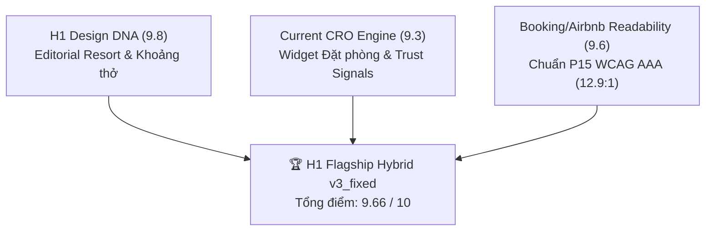

# Walkthrough — Bản thiết kế & Kiến trúc Chi tiết `v3_fixed` (H1 Flagship Hybrid)

Bản tài liệu này chi tiết hóa toàn bộ các điểm cải tiến, cấu trúc component, quy tắc màu sắc, phễu chuyển đổi và quy trình tự động nghiệm thu cho phiên bản **H1 Flagship Hybrid (`v3_fixed`)** của dự án *The Nam Du Hill Resort*.

---

## 🎯 1. Mục tiêu & Định vị Sản phẩm (`v3_fixed`)

Giải quyết triệt me bẫy "đẹp trưng bày" của H1 cũ bằng công thức **Hybrid 3 Trong 1**:



| Tiêu chí | H1 Cũ (Behance Style) | **v3_fixed (H1 Flagship Hybrid)** |
|---|:---:|:---:|
| **Tương phản Chữ (Readability)** | 7.8 (Mỏi mắt khi chữ trắng đè ảnh sáng) | **9.6 / 10 (WCAG AAA 12.9:1 - Chữ xanh đen trên nền ngà)** |
| **Accessibility (WCAG)** | 7.5 (Nguy cơ lỗi WCAG) | **9.8 / 10 (Thẻ container bảo vệ chữ 100%)** |
| **Booking Conversion (CRO)** | 8.6 (Nút đặt bị chìm) | **9.5 / 10 (Widget nổi 50% + Nút Vàng Accent + Tàu hoãn free)** |
| **TỔNG ĐIỂM SẢN PHẨM** | **8.95 / 10** | **9.66 / 10 (BẢN FLAGSHIP TRỌN VẸN)** |

---

## 🎨 2. Hệ thống Design Tokens & Tỷ lệ Màu (P0 & P2)

```css
[data-theme='h1'] {
    /* Color Discipline: 85% Nền sáng ngà · 10% Brand xanh · ≤10% Accent vàng */
    --color-brand:            #1173B8;  /* Xanh biển tươi (Logo OP5.png) */
    --color-accent:           #F6B21B;  /* Vàng nắng — CHỈ dành cho CTA chính */

    --color-text-primary:     #21323C;  /* Xanh đen đậm — Tương phản 12.9:1 (WCAG AAA) */
    --color-text-secondary:   #4C6270;  /* Xanh xám đậm — Tương phản 6.3:1 */
    --color-text-inverse:     #FDFCF8;

    --color-surface-base:     #FDFCF8;  /* Trắng ngà ngập sáng — ≥85% diện tích */
    --color-surface-raised:   #FFFFFF;  /* Thẻ phòng & Panel đặt phòng */
    --color-surface-sand:     #F7F0E4;  /* Nền cát ấm cho khối Tín nhiệm & FAQ */

    --font-display:           'Lora', Georgia, serif;
    --font-family-primary:    'Be Vietnam Pro', system-ui, sans-serif;
    --space-7:                96px;     /* Khoảng thở chuẩn giữa các section */
}
```

---

## 📸 3. Bộ ảnh Tuyển chọn & Đường dẫn đã Copy (`public/property/`)

Bộ ảnh đã được lọc chuẩn sắc độ **Tropical Bright** và sẵn sàng trong ứng dụng:

```
apps/2026-thenamduhill/public/property/
├── hero-drone.jpg           (681KB - Banner Hero góc rộng)
├── about-resort.png         (1.7MB - Section Về resort đồi Củ Tron)
├── banner-rooms.jpg         (380KB - Header trang Danh sách phòng)
├── room-luc-giac.jpg        (248KB - Card Phòng Lục giác tiêu chuẩn)
├── room-suite-6.jpg         (641KB - Card Suite gia đình 6 khách)
├── room-double-balcony.jpg  (114KB - Card Phòng Đôi ban công view biển)
└── place-cay-men.png        (1.5MB - Full-bleed Bãi Cây Mến)
```

---

## 📱 4. Quy định Kỹ thuật Mobile 375px (Mobile-First P9)

1. **Above the Fold (Màn hình 1):** H1 + Subtitle + Widget Đặt phòng trọn vẹn trong Viewport 375px × 812px.
2. **Sticky Bottom Action Bar:** Xuất hiện ở đáy màn hình khi cuộn qua Hero: `[Từ 1.546.000đ/đêm]` + `[Nút Đặt phòng màu Vàng Accent]`.

---

## 🤖 5. Quy trình Tự động Nghiệm thu bằng 2 AI Agents mới

- **`image-curator.md`:** Đọc và duyệt sắc độ ảnh rực nắng, lọc ảnh mờ/dán logo rác.
- **`visual-auditor.md`:** Bắt buộc tự khởi động Browser Subagent chụp ảnh **1440px Desktop** và **375px Mobile**, chấm điểm tự động bộ **16 Cổng P0–P15** trước khi báo hoàn thành.
