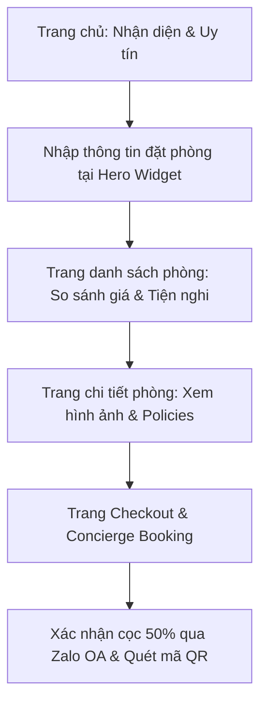

# ĐẶC TẢ YÊU CẦU & KỊCH BẢN XÂY DỰNG WEBSITE MỚI TOÀN DIỆN
## Dự án: Nền Tảng Booking & Trải Nghiệm Khách Sạn - The Nam Du Hill Resort
### (Tài liệu xây dựng mới từ đầu kết hợp Spec V3 Fixed - H1 Flagship)

Tài liệu này đóng vai trò là bản đặc tả yêu cầu chi tiết để phát triển **hoàn toàn mới** một website thương mại & quảng bá cho The Nam Du Hill Resort. Website mới không chỉ đơn thuần là trang tin tức hay giới thiệu, mà là một nền tảng đặt phòng trực tuyến (Booking Engine) tối ưu trải nghiệm, giải quyết nỗi lo về độ uy tín và tăng tối đa chuyển đổi đặt phòng trực tiếp.

---

## 1. Mục Tiêu Dự Án & Định Vị Thương Hiệu
*   **Mục tiêu:** Thay thế website cũ bằng một website mới đạt chuẩn luxury, phản ánh trung thực hình ảnh chính chủ của resort trên đồi Củ Tron, nâng cao niềm tin của khách hàng trực tuyến.
*   **Định vị:** Phân khúc nghỉ dưỡng cao cấp tại đảo hoang sơ Nam Du, mang tinh thần tối giản, sang trọng (Quiet Luxury & Tropical Editorial) kết hợp linh hoạt công nghệ chuyển đổi đặt phòng trực tiếp (CRO).
*   **Khách hàng mục tiêu:** Khách du lịch trong và ngoài nước (Song ngữ tiếng Việt & tiếng Anh).

---

## 2. Bối Cảnh Nghiệp Vụ & Luồng Hoạt Động (User Flow)
Website mới sẽ xây dựng mới luồng trải nghiệm khách hàng xuyên suốt (End-to-End User Flow):

### 2.1 Luồng Đặt Phòng Bán Tự Động (Concierge Booking)
*   Do resort chưa kết nối cổng thanh toán thẻ quốc tế tự động (Stripe/VNPay), hệ thống sẽ áp dụng mô hình **Concierge Booking (Đặt phòng có hỗ trợ người thật)**:
    1.  Khách hàng chọn hạng phòng, ngày nhận/trả phòng và số khách.
    2.  Hệ thống tự động tính tổng tiền phòng, các phụ phí đi kèm và số tiền cần đặt cọc trước (**50% tổng bill**).
    3.  Khách hàng bấm xác nhận đặt phòng, thông tin sẽ được chuyển sang dạng phiếu đặt.
    4.  **Kênh phản hồi chính:** Hệ thống tích hợp sâu với **Zalo OA chính chủ** để lễ tân nhận thông tin đặt phòng ngay lập tức và xác nhận với khách, gửi kèm số tài khoản ngân hàng chính chủ của công ty/chủ resort cùng mã QR thanh toán để khách an tâm chuyển cọc.

---

## 3. Bản Sắc Thiết Kế & Hướng Dẫn Nghệ Thuật (Spec V3 Fixed)
Website mới được xây dựng theo bộ quy chuẩn thẩm mỹ **H1 Flagship V3 Fixed**, giải quyết triệt để lỗi tương phản yếu của bản thiết kế cũ để đạt điểm chất lượng **9.66/10**:

### 3.1 Bảng Màu Thiên Nhiên Đảo Nam Du
*   **Màu nền chính (Base Surface - `#FDFCF8`):** Trắng ngà ngập tràn ánh nắng ấm áp của Nam Du, chiếm trên 85% diện tích website.
*   **Màu nhận diện thương hiệu (Brand Color - `#1173B8`):** Sắc xanh ngọc đại dương rực rỡ, lấy trực tiếp từ logo chính thức `OP5.png`.
*   **Màu văn bản chính (Primary Text - `#21323C`):** Xanh đen đậm sâu thẳm, đạt độ tương phản tuyệt đối **12.9:1 (WCAG AAA)** trên nền ngà để người dùng không bị mỏi mắt khi đọc lâu.
*   **Màu nhấn hành động (Accent CTA Color - `#F6B21B`):** Vàng nắng hoàng hôn rực rỡ. Để tạo nhịp điệu thị giác (P4), màu vàng này **chỉ dành duy nhất cho nút bấm hành động chính (CTA)** trong mỗi viewport.
*   **Nền cát ấm (Sand Surface - `#F7F0E4`):** Dùng cho các phần xen kẽ như thanh tìm phòng, dải tín nhiệm.

### 3.2 Spacing & Typography
*   **Typography:** Tiêu đề lớn dùng font **Lora (Serif)** thể hiện tính nghệ thuật, cổ điển của các khu nghỉ dưỡng. Phần nội dung mô tả dùng font **Be Vietnam Pro (Sans-serif)** rõ ràng và hiện đại.
*   **Khoảng thở:** Áp dụng khoảng thở rộng rãi theo chuẩn resort hạng sang (`--space-7: 96px`, `--space-8: 140px`) để trang web thanh lịch và dễ đọc.

---

## 4. Cấu Trúc Các Trang Chức Năng Bắt Buộc

Website mới sẽ bao gồm toàn bộ các trang nghiệp vụ hoàn chỉnh sau:

### 4.1 Trang Chủ (Home Page)
*   **Section 1: Hero Magazine & Booking Widget:**
    *   Bố cục Split 60/40 hiện đại. Bên trái là tiêu đề và mô tả giới thiệu được bảo vệ tương phản, bên phải là ảnh phong cảnh đồi Củ Tron view toàn cảnh Nam Du.
    *   Thanh tìm phòng **Booking Widget** đè nổi 50% ở cạnh dưới Hero.
    *   **Trust Reassurance:** Đặt sát nút bấm CTA dòng thông tin: *"📞 Hotline chính chủ: 0985 000 650"* và *"⛴ Tàu hoãn do thời tiết: Dời ngày miễn phí 100%"*.
*   **Section 2: Trust & Identity Bar:**
    *   Dải định danh làm rõ: Resort chính chủ do người bản địa tự xây dựng và quản lý; Hỗ trợ xe điện đón khách tại bến tàu Nam Du; Cam kết hoàn hủy linh hoạt do tàu hoãn.
*   **Section 3: Sanctuary Rooms:**
    *   Grid giới thiệu 3 hạng phòng tiêu biểu (Phòng Lục Giác, Đôi Ban Công View Biển, Suite Gia Đình 6 Khách) kèm thông số diện tích, giá khởi điểm và nút xem chi tiết.
*   **Section 4: About & Video Intro:**
    *   Kể câu chuyện về resort trên đồi cao ngắm hoàng hôn, tích hợp video giới thiệu local `video/8102936365457.mp4` dạng click-to-play bằng modal để tối ưu tốc độ load trang.
*   **Section 5: Dining & Experiences:**
    *   Giới thiệu thực đơn hải sản tươi sống đánh bắt trong ngày tại đảo Nam Du, tour câu mực đêm và các bãi tắm hoang sơ (Bãi Cây Mến).
*   **Section 6: FAQ & Footer:**
    *   Hỏi đáp nhanh các thông tin cọc, giờ tàu chạy. Footer đầy đủ mã số thuế doanh nghiệp, bản đồ Google Maps và nút liên kết Zalo OA.

### 4.2 Trang Danh Sách Phòng & Bảng Giá (Rooms & Suites)
*   Bộ lọc nhanh hạng phòng.
*   Bố cục hàng ngang (Desktop) chuyên nghiệp: bên trái là ảnh phòng (cho phép click mở lightbox xem 3 tấm ảnh thực tế), ở giữa là chi tiết tiện nghi phòng (điều hòa, ban công, WC, diện tích), bên phải là cột giá và nút CTA **[Đặt phòng này]**.

### 4.3 Trang Chi Tiết Phòng (Room Detail)
*   Lưới ảnh gallery 5 tấm thực tế.
*   Bảng đặt phòng nổi bên phải màn hình (Sticky Booking Panel) tính tiền cọc trực tiếp dựa trên số đêm khách chọn.
*   Các thông tin mô tả chi tiết được chia thành 3 Tab: Tổng quan tiện nghi · Chính sách nhận/trả phòng · Chính sách hoàn hủy do thời tiết.

### 4.4 Các Trang Phụ Trợ (Experiences, Events, News, Gallery)
*   **Experiences (Khám phá):** Các tour đảo, bãi tắm đẹp tại Nam Du để kích thích nhu cầu đi du lịch của khách.
*   **Events (Sự kiện):** Tiệc cưới ngoài trời, họp mặt gia đình trên đồi.
*   **News & Gallery:** Tin tức giờ tàu chạy cập nhật và kho ảnh phong cảnh chất lượng cao.

---

## 5. Quy Chuẩn Kỹ Thuật Mobile (Mobile-First 375px)
*   Đảm bảo tất cả layout tự động co giãn về thẻ dọc một cột mượt mà.
*   Thanh tìm phòng trên Hero phải hiển thị trọn vẹn ở màn hình đầu tiên không bắt cuộn.
*   Khi cuộn trang xuống, luôn có một **Sticky Bottom Bar** cố định dưới đáy màn hình hiển thị giá phòng và nút gọi/đặt phòng nhanh qua Zalo.

---

## 6. Tiêu Chí Nghiệm Thu Đưa Lên Online (Definition of Done)
1.  **Về Dữ Liệu:** Toàn bộ nội dung thật được refactor từ crawl data, dịch chuẩn song ngữ Việt - Anh, lưu trữ tập trung tại `@repo/core`.
2.  **Về Trực Quan:** Đạt độ tương phản tối thiểu 7.0:1 (chuẩn WCAG AAA), nút nhấn vàng hoàng hôn đúng vị trí, ảnh chụp sắc nét chuẩn tropical đã được copy vào `public/property/`.
3.  **Về Tín Nhiệm:** Zalo OA Fab Button hoạt động chính xác ở góc màn hình, thông tin hotline và cam kết thời tiết xuất hiện đầy đủ tại các điểm chạm nhạy cảm.
4.  **Về Build & Deploy:** Ứng dụng vượt qua kiểm tra `pnpm check`, build thành công và chạy ổn định trên hosting Vercel với domain chính chủ.
